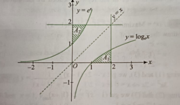

# Area of Remaining Region (Difficulty: Easy)

## Problem Statement

Consider the region formed by the lines $x = 0, y = 0, x = 2, y = 2$.  
The area enclosed by the curves $y = e^x$ and $y = \log_e x$, within this region, is being removed.  

Find the area of the **remaining region**. (Answer in **3 decimal places**)

---

## Solution

We know that $y = e^x$ and $y = \log_e x$ are inverses of each other.  
So, their graphs are symmetrical about the line $y = x$.

$$
\text{Area of the square } OABC = 4 \ \text{sq. units.}
$$

Areas $A_1$ and $A_2$ are the same.  
So, area of the shaded region is:

$$
= 2A_1
$$

$$
= 2 \int_{1}^{2} \log_e x \, dx
$$

$$
= 2 \left[ x \log_e x - x \right]_1^2
$$

$$
= 2 \left( 2\log_e 2 - 1 \right) \quad \text{sq. units.}
$$

Therefore, the area of the **remaining region** of the square is:

$$
4 - 2(2\log_e 2 - 1) = 6 - 4 \log_e 2 \quad \text{sq. units.}
$$

---

## Final Answer

$$
\boxed{6 - 4 \log_e 2 \ \text{sq. units}} = 3.227
$$
## Reference image
