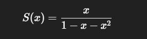
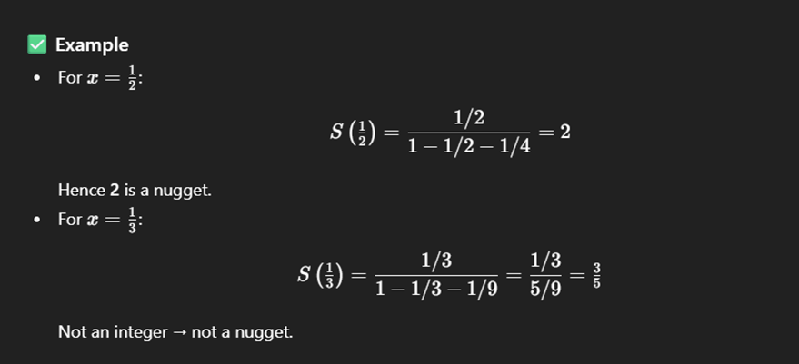

**Description**

Consider the series:

S(x)=F1x+F2x^2+F3x^3+⋯

where Fk  is the k-th Fibonacci number (F1=1,F2=1,F3=2,F4=3,…)

**Task:**

We say that x produces a **nugget** if the value of S(x) (up to infinity) is an **integer**.

1. Show that this infinite sum can be expressed as:

**write a program** to find the sum of all integer nuggets of S(x) for 1≤nugget≤20

**Solution:**

Nuggets up to 20:
2 15
Sum of nuggets up to 20: 17